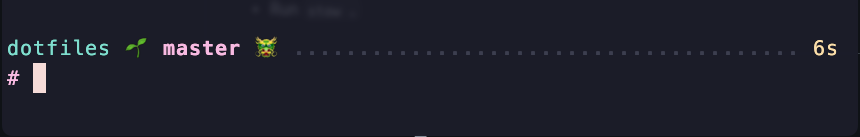

# .dotfiles



## Install

One-liner on a fresh macOS machine:

```bash
curl -fsSL https://raw.githubusercontent.com/alexrqs/dotfiles/master/bootstrap.sh | bash
```

Defaults to the `light` profile. Pick a profile to match the machine:

```bash
# MacBook Neo — minimum
curl -fsSL https://raw.githubusercontent.com/alexrqs/dotfiles/master/bootstrap.sh | bash -s light

# Air 16/32GB — work-style, no nmap/httrack
curl -fsSL https://raw.githubusercontent.com/alexrqs/dotfiles/master/bootstrap.sh | bash -s corporate

# Studio / MBP — everything
curl -fsSL https://raw.githubusercontent.com/alexrqs/dotfiles/master/bootstrap.sh | bash -s full
```

If `git` isn't installed yet, type `git` in Terminal to trigger the Xcode CLT installer, wait for it to finish, then re-run the command above.

## What it does

1. Installs Oh My Zsh, Homebrew, clones this repo to `~/dotfiles`.
2. Installs the brew packages from `scripts/profiles/Brewfile.<profile>` and offers to uninstall packages not in the profile (`brew bundle cleanup`).
3. Clones oh-my-zsh plugins (syntax-highlighting, autosuggestions, autocomplete).
4. Refreshes the kitty dock icon, sets macOS keyboard tweaks.
5. Prompts to run `stow` / `stow --adopt` / skip for the dotfiles symlinks.
6. Installs Node 20 + 22 via nvm and bootstraps LazyVim plugins.
7. On first install, prompts for personal/work git identities and writes `~/.temp`.

## Re-running

Already cloned? Run the post-clone driver directly:

```bash
~/dotfiles/scripts/install.sh <light|corporate|full>
```

Update git identities later:

```bash
~/dotfiles/scripts/personalize.sh
```

## Design

Spec: `docs/superpowers/specs/2026-05-11-curl-bash-installer-design.md`
